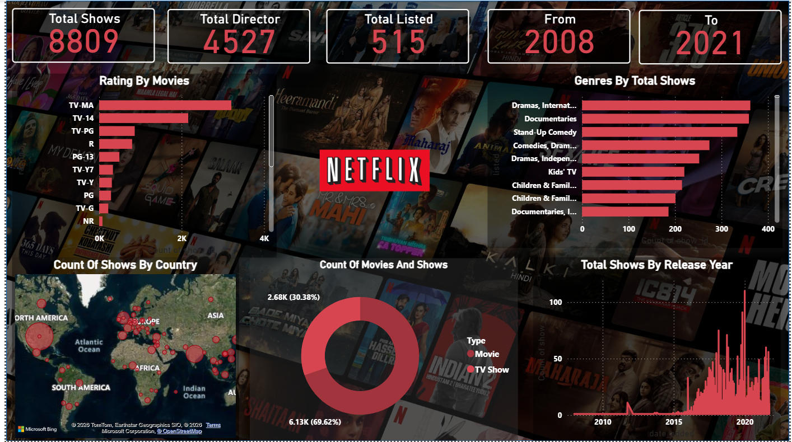

# 🎬 Netflix Power BI Dashboard

##  Interactive Dashboard for Netflix Content Analysis

This project showcases an interactive **Power BI Dashboard** built using the **Netflix Titles Dataset**. The dashboard provides valuable insights into Netflix's global content library by analyzing content distribution, ratings, genres, countries, and release trends through interactive visualizations.

The objective of this project is to transform raw Netflix data into meaningful business insights using effective data visualization techniques, enabling users to explore content patterns and trends efficiently.

---
##  Dashboard Preview

<p align="center">
  
</p>

---
##  Table of Contents

## Table of Contents

- [Project Overview](#project-overview)
- [Business Objective](#business-objective)
- [Dataset Information](#dataset-information)
- [Data Validation](#data-validation)
- [Tools & Technologies](#tools--technologies)
- [Dashboard KPIs](#dashboard-kpis)
- [Dashboard Visualizations](#dashboard-visualizations)
- [Key Business Insights](#key-business-insights)
- [Project Workflow](#project-workflow)
- [Repository Structure](#repository-structure)
- [Future Enhancements](#future-enhancements)
- [Author](#author)

---
#  Project Overview

The Netflix Power BI Dashboard is a business intelligence project designed to analyze Netflix's content library using interactive data visualizations. The dashboard transforms raw data into meaningful insights, helping users understand content distribution, ratings, genres, geographical availability, and release trends.

The project demonstrates how Power BI can be used to convert structured datasets into interactive dashboards that support data-driven decision-making and exploratory analysis.

---
#  Business Objective

The primary objective of this project is to analyze Netflix's content catalog and present meaningful insights through an interactive Power BI dashboard.

The dashboard aims to:

- Analyze the overall Netflix content library.
- Understand the distribution of Movies and TV Shows.
- Explore content ratings across the platform.
- Identify the most popular genres.
- Visualize the geographical distribution of Netflix content.
- Analyze content release trends over time.
- Present business insights using interactive visualizations and KPI cards.

---
#  Dataset Information

| Attribute | Details |
|-----------|---------|
| Dataset Name | Netflix Titles Dataset |
| File Format | CSV |
| Dashboard Tool | Microsoft Power BI Desktop |
| Total Records | 8,809 Titles |
| Time Period | 2008 – 2021 |
| Data Source | Public Netflix Dataset |

The dataset contains information about Netflix Movies and TV Shows, including titles, directors, countries, release years, ratings, genres, and content types.

---
#  Data Validation

Before creating the dashboard, the dataset was validated to ensure data quality and consistency.

The validation process included:

- Verified column data types.
- Checked for missing (null) values.
- Checked for duplicate records.
- Reviewed data consistency before visualization.
- Confirmed that the dataset was suitable for KPI calculations and dashboard development.

This validation process helped ensure that the dashboard insights accurately represent the underlying dataset.

---
#  Tools & Technologies

| Tool / Technology | Purpose |
|-------------------|---------|
| Microsoft Power BI Desktop | Dashboard Development & Visualization |
| CSV Dataset | Data Source |
| Power BI Data View | Data Validation |
| KPI Cards | Business Metrics |
| Stacked Bar Charts | Category Comparison |
| Donut Chart | Content Distribution |
| Filled Map | Country-wise Analysis |
| Area Chart | Release Trend Analysis |

---
#  Dashboard KPIs

The dashboard includes the following Key Performance Indicators (KPIs):

| KPI | Value |
|------|------:|
|  Total Shows | **8,809** |
|  Total Directors | **4,527** |
|  Total Genres Listed | **515** |
|  Content Timeline | **2008 – 2021** |

These KPI cards provide a quick summary of Netflix's content library before exploring the detailed visualizations.

---
#  Dashboard Visualizations

The dashboard consists of multiple interactive visualizations designed to provide comprehensive insights into Netflix's content catalog.

### Visualizations Included

-  **Stacked Bar Chart** – Distribution of Content Ratings
-  **Stacked Bar Chart** – Top Genres by Total Shows
-  **Donut Chart** – Movies vs TV Shows Distribution
-  **Filled Map** – Country-wise Content Distribution
-  **Area Chart** – Total Shows Released by Year

Together, these visualizations allow users to explore Netflix's content from multiple business perspectives.

---
#  Key Business Insights

- Netflix's library contains **8,809** titles.
- Movies constitute the majority of the available content compared to TV Shows.
- **TV-MA** is the most common content rating.
- Drama-related genres dominate the Netflix catalog.
- Content is distributed across multiple countries, with major contributions from the **United States** and **India**.
- Netflix experienced significant growth in content releases after **2015**.
- Interactive filters enable users to explore the dataset by rating, genre, country, and release year.

---
#  Project Workflow

```text
Netflix Titles Dataset (CSV)
            │
            ▼
      Data Validation
(Data Types • Missing Values • Duplicates)
            │
            ▼
      Data Preparation
            │
            ▼
    Dashboard Development
      (Power BI Desktop)
            │
            ▼
     KPI Card Creation
 (Simple Aggregations)
            │
            ▼
 Interactive Visualizations
            │
            ▼
     Business Insights
```

---
#  Repository Structure

```text
Netflix-PowerBI-Dashboard/
│
├── README.md
├── Netflix_PowerBI_Dashboard.pbix
├── netflix_titles.csv
└── dashboard.png
```

---
#  Future Enhancements

Possible future improvements for this project include:

- Add interactive drill-through pages for deeper analysis.
- Implement DAX measures for advanced business metrics.
- Enhance dashboard interactivity with additional slicers and bookmarks.
- Automate data refresh using Power BI Service.
- Expand the dashboard with additional KPIs and trend analysis.

---
#  Author

**Ayush Raj**

MBA Student | Aspiring Data Analyst

### Connect with Me

- **GitHub:** https://github.com/Ayush230-Analyst

---

 If you found this project interesting, consider giving it a **Star** on GitHub!
